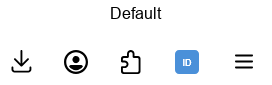

# UUID Clipper

A minimal Firefox extension that generates a random UUID and copies it to your clipboard with a single click.

## Features

- One-click UUID generation from the toolbar
- Right-click context menu to paste a new UUID directly into any editable text field
- Uses the browser's built-in `crypto.randomUUID()` — no external dependencies
- Brief ✓ badge confirms the copy
- Zero data collection, zero network requests

<div style="text-align:center"></div>

## Installation

### From Firefox Add-ons (AMO)

_(Link to be added once approved)_

### From source

1. Clone this repository
2. Open Firefox and navigate to `about:debugging#/runtime/this-firefox`
3. Click **Load Temporary Add-on...**
4. Select the `manifest.json` file

> [!IMPORTANT]
> Temporary add-ons are removed when Firefox closes.

## Development

### Prerequisites

- Firefox 95+
- [web-ext](https://github.com/mozilla/web-ext) (optional, for building/testing)

```sh
npm install -g web-ext
```

### Run locally with auto-reload

```sh
web-ext run --source-dir .
```

### Build

```sh
web-ext build --source-dir . --artifacts-dir dist --overwrite-dest
```

This produces a `.zip` in `dist/` that can be submitted to [AMO](https://addons.mozilla.org/developers/) for signing.

## Project Structure

```
uuid-clipper-extension/
├── assets/
│   ├── icon-128.png        # 128x128 icon for AMO listing
│   ├── toolbar-default.png # Screenshot — default state
│   └── toolbar-clicked.png # Screenshot — after click (✓ badge)
├── manifest.json           # Extension manifest (Manifest V2)
├── background.js           # Toolbar click handler — generates UUID and copies to clipboard
├── icon.svg                # Toolbar and extension icon (48x48 SVG)
└── README.md
```

## How It Works

### Toolbar button

1. `crypto.randomUUID()` generates a v4 UUID
2. `navigator.clipboard.writeText()` copies it to the clipboard
3. A ✓ badge appears on the icon for 1.5 seconds to confirm

### Context menu

Right-click any editable field (input, textarea, or contentEditable element) and select **Paste new UUID** — a freshly generated UUID is inserted at the cursor position.

## CI/CD

A GitHub Actions workflow runs on every push:

- **All branches** — lints and builds the extension, uploads the `.zip` as a workflow artifact
- **`main` branch** — additionally creates a GitHub Release with the `.zip` attached

The release is tagged using the `version` from `manifest.json` (e.g. `v1.0`). To create a new release, bump the version in `manifest.json` before merging to `main`.

## Contributing

Contributions are welcome! Feel free to open an issue or submit a pull request.

1. Fork the repository
2. Create your feature branch (`git checkout -b feature/my-change`)
3. Commit your changes (`git commit -m 'Add some feature'`)
4. Push to the branch (`git push origin feature/my-change`)
5. Open a Pull Request

## License

This project is licensed under the [MIT License](LICENSE).
